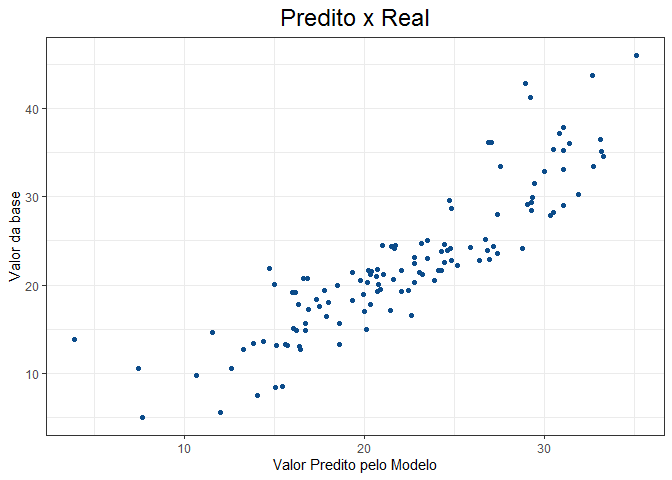

Modelo\_Regressao
================
Vinicius Jacobs
23/01/2021

#### O objetivo deste projeto é construir um modelo de regressão linear para estimar a taxa média de ocupação das casas pelos proprietários em Boston.

#### O data set utilizado contem o valor da taxa média de ocupação das casas juntamente com outras 13 variáveis socioeconomicas.

#### Pacotes utilizados

``` r
library(tidymodels)
library(tidyverse)
library(vip)
library(mlbench)
library(corrplot)
```

#### Carregando o data set

``` r
data("BostonHousing")
```

#### Visualizando os dados

``` r
glimpse(BostonHousing)
#> Rows: 506
#> Columns: 14
#> $ crim    <dbl> 0.00632, 0.02731, 0.02729, 0.03237, 0.06905, 0.02985, 0.088...
#> $ zn      <dbl> 18.0, 0.0, 0.0, 0.0, 0.0, 0.0, 12.5, 12.5, 12.5, 12.5, 12.5...
#> $ indus   <dbl> 2.31, 7.07, 7.07, 2.18, 2.18, 2.18, 7.87, 7.87, 7.87, 7.87,...
#> $ chas    <fct> 0, 0, 0, 0, 0, 0, 0, 0, 0, 0, 0, 0, 0, 0, 0, 0, 0, 0, 0, 0,...
#> $ nox     <dbl> 0.538, 0.469, 0.469, 0.458, 0.458, 0.458, 0.524, 0.524, 0.5...
#> $ rm      <dbl> 6.575, 6.421, 7.185, 6.998, 7.147, 6.430, 6.012, 6.172, 5.6...
#> $ age     <dbl> 65.2, 78.9, 61.1, 45.8, 54.2, 58.7, 66.6, 96.1, 100.0, 85.9...
#> $ dis     <dbl> 4.0900, 4.9671, 4.9671, 6.0622, 6.0622, 6.0622, 5.5605, 5.9...
#> $ rad     <dbl> 1, 2, 2, 3, 3, 3, 5, 5, 5, 5, 5, 5, 5, 4, 4, 4, 4, 4, 4, 4,...
#> $ tax     <dbl> 296, 242, 242, 222, 222, 222, 311, 311, 311, 311, 311, 311,...
#> $ ptratio <dbl> 15.3, 17.8, 17.8, 18.7, 18.7, 18.7, 15.2, 15.2, 15.2, 15.2,...
#> $ b       <dbl> 396.90, 396.90, 392.83, 394.63, 396.90, 394.12, 395.60, 396...
#> $ lstat   <dbl> 4.98, 9.14, 4.03, 2.94, 5.33, 5.21, 12.43, 19.15, 29.93, 17...
#> $ medv    <dbl> 24.0, 21.6, 34.7, 33.4, 36.2, 28.7, 22.9, 27.1, 16.5, 18.9,...
```

###### CRIM: per capita crime rate by town

###### ZN: proportion of residential land zoned for lots over 25,000 sq.ft.

###### INDUS: proportion of non-retail business acres per town

###### CHAS: Charles River dummy variable (= 1 if tract bounds river; 0 otherwise)

###### NOX: nitric oxides concentration (parts per 10 million)

###### RM: average number of rooms per dwelling

###### AGE: proportion of owner-occupied units built prior to 1940

###### DIS: weighted distances to five Boston employment centres

###### RAD: index of accessibility to radial highways

###### TAX: full-value property-tax rate per 10,000

###### PTRATIO: pupil-teacher ratio by town

###### B: 1000(Bk - 0.63)^2 where Bk is the proportion of blacks by town

###### LSTAT: % lower status of the population

###### TARGET: Median value of owner-occupied homes in $1000’s

#### Verificando valores:

``` r
questionr::freq.na(BostonHousing)
#>         missing %
#> crim          0 0
#> zn            0 0
#> indus         0 0
#> chas          0 0
#> nox           0 0
#> rm            0 0
#> age           0 0
#> dis           0 0
#> rad           0 0
#> tax           0 0
#> ptratio       0 0
#> b             0 0
#> lstat         0 0
#> medv          0 0
```

#### Avaliando a distribuição da variável Target

``` r
BostonHousing %>%
  ggplot()+
  geom_histogram(aes(BostonHousing$medv),fill = "#0c4c8a")+
  theme_bw()+
  labs(
    x = "Vlr_Median",
    y = "Count",
    title = "Distribuição da váriavel MEDV"
  )+
  theme(
  plot.title = element_text(
    hjust = 0.5,
    size = 15
  ))
```

<!-- -->

#### Retirando valores extremos da base

``` r
BostonHousing <-  BostonHousing %>% 
  filter(medv <46.7)
```

#### Verificando correlação entre as variáveis

``` r
c.negativ
#>               medv
#> crim    -0.4618120
#> indus   -0.6051708
#> nox     -0.5433237
#> age     -0.5054700
#> rad     -0.4895081
#> tax     -0.5796923
#> ptratio -0.5097983
#> lstat   -0.7676208
```

``` r
c.postiv
#>         medv
#> rm 0.6621601
```

``` r
corrplot(c.var.import)
```

<!-- -->

#### Divisão da base

``` r
bh_initial_split <- BostonHousing %>% initial_split(0.75)

bh_train <- training(bh_initial_split)
bh_test <- testing(bh_initial_split)
```

#### Criando a “receita”

``` r
bh_recipe <- recipe(medv ~  ., data = bh_train) %>%
  step_normalize(all_numeric(), -all_outcomes()) %>%
  step_dummy(all_nominal()) %>%
  step_zv(all_predictors())

prep(bh_recipe)
juice(prep(bh_recipe))
```

#### Definindo o modelo

``` r
bh_model <- linear_reg(
  penalty = tune(),
  mixture = tune() # LASSO
) %>%
  set_engine("glmnet")
```

#### Criando o Workflow

``` r
bh_wf <- workflow() %>%
  add_model(bh_model) %>%
  add_recipe(bh_recipe)
```

#### Cross-Validation

``` r
# reamostragem com cross-validation 
bh_resamples <- vfold_cv(bh_train, v = 5)
```

#### Tunagem dos hiperparâmetros

``` r
bh_tune_grid <- tune_grid(
  bh_wf,
  resamples = bh_resamples,
  grid = 10,
  metrics = metric_set(rmse),
  control = control_grid(verbose = FALSE, allow_par = FALSE)
)
```

#### Coletando os melhores parâmetros

``` r
collect_metrics(bh_tune_grid)
```

``` r
show_best(bh_tune_grid, "rmse")
#> # A tibble: 5 x 8
#>    penalty mixture .metric .estimator  mean     n std_err .config
#>      <dbl>   <dbl> <chr>   <chr>      <dbl> <int>   <dbl> <chr>  
#> 1 1.83e-10  0.0877 rmse    standard    3.64     5   0.160 Model01
#> 2 8.84e- 9  0.174  rmse    standard    3.64     5   0.160 Model02
#> 3 1.59e- 3  0.270  rmse    standard    3.64     5   0.160 Model03
#> 4 4.16e- 7  0.463  rmse    standard    3.64     5   0.160 Model05
#> 5 3.24e- 6  0.349  rmse    standard    3.64     5   0.160 Model04
```

``` r

bh_best_hiperparams <- select_best(bh_tune_grid, "rmse")

bh_wf <- bh_wf %>%
  finalize_workflow(bh_best_hiperparams)
```

#### Modelo Final

``` r
bh_last_fit <- bh_wf %>% last_fit(split = bh_initial_split)

collect_metrics(bh_last_fit)
#> # A tibble: 2 x 3
#>   .metric .estimator .estimate
#>   <chr>   <chr>          <dbl>
#> 1 rmse    standard       3.94 
#> 2 rsq     standard       0.805

collect_predictions(bh_last_fit) %>%
  ggplot(aes(.pred, medv)) +
  geom_point(colour = "#0c4c8a")+
  theme_bw()+
  labs(
    x = "Valor Predito pelo Modelo",
    y = "Valor da base",
    title = "Predito x Real"
  )+
  theme(
  plot.title = element_text(
    hjust = 0.5,
    size = 18
  ))
```

<!-- -->

``` r

bh_final_model <- bh_wf %>%
  fit(data = BostonHousing)
```

#### Importância das variáveis

``` r

vip::vi(bh_final_model$fit$fit) %>%
  mutate(
    abs_importance = abs(Importance),
    Variable = fct_reorder(Variable, abs_importance)
  ) %>%
  ggplot(aes(x = abs_importance, y = Variable, fill = Sign)) +
  geom_col()+
  theme_bw()+
  labs(
    x = "Importancia (Valor Absoluto)",
    y = "Variável",
    title = "Importância das Variáveis no modelo"
  )+
  theme(
  plot.title = element_text(
    hjust = 0.5,
    size = 18
  ))
```

<!-- -->

#### Prediçoes

``` r

bh_com_previsao <- BostonHousing %>%
  mutate(
    medv_pred = predict(bh_final_model, new_data = .)$.pred
  )
```
